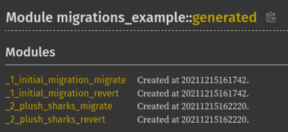

# SQLx Migrate

 

An opinionated database migration micro-framework library built on top of [SQLx](https://github.com/launchbadge/sqlx).

**Everything is experimental**, breaking changes can happen and the long-term purpose of this library is not yet clear, **use at your own risk**!

- [SQLx Migrate](#sqlx-migrate)
  - [Features](#features)
  - [**Not** Features](#not-features)
  - [Usage](#usage)
  - [Feature Flags](#feature-flags)
  - [TODO](#todo)
    - [Supported Databases](#supported-databases)
  - [The Why](#the-why)
  - [The How](#the-how)
  - [The Name](#the-name)
  - [Alternatives](#alternatives)

## Features

- Versioned migrations embedded in Rust code
- Reversible (undo/rollback) migrations
- Rust migration "scripts"
- Embedded SQL scripts
- CLI bookkeeping application distributed as a library

## **Not** Features

- Pre-compiled CLI for running arbitrary SQL scripts
- In-depth database administration
- Generated undo/rollback migrations
- Support for anything other than SQLx

## Usage

For usage purely from Rust code, see the [documentation reference](https://docs.rs/sqlx-migrate).

For generated code, embedded migrations, and CLI usage see the [example](examples/migrations-example).

## Feature Flags

All features are disabled by default.

- `generate`: Enable the ability to generate migration code with checksums and dates in `build.rs` scripts.
- `cli`: Expose a CLI [clap](https://docs.rs/clap/3.0.0-rc.5/clap/index.html) application as a library that can manage a given migration set.
- `validate-sql`: Validate SQL files during code generation on a best-effort basis.

Database-specific features:

- `postgres`: Enable `postgres` support.

## TODO

- [ ] Proper tests
- [ ] Verify correctness, safety
- [ ] Probably better documentation
- [ ] Support more databases

### Supported Databases

- [x] Postgres
- [ ] The rest of the owl

## The Why

I am in the process of transitioning an existing NodeJS project to a Rust-based solution, and while I prefer SQL in code to ORMs, I missed not being able to interact with migrations in procedural (javascript or any other) code when needed. While certainly possible, I consider some transformations and more complex operations in SQL to be a chore.

I had the following requirements:

- I wanted to write some migration logic in anything but SQL
- I needed to run the migrations against any (usually empty) database in CI/CD
- I wanted proper automatic bookkeeping and reversible migrations
- Ideally with no third-party tools required for easier tests and deployments (and definitely no 1GB `node_modules` directories)

I could've simply written functions that ran some queries against the database, but I still needed to keep track of them. So this is pretty much what I did in a generalized form and with some additional features.

## The How

The basic idea was to do all database operations via SQLx and define an interface for migrations that are pretty much just functions that operate on given SQLx transactions.

Then provide some way, a `Migrator` that does the bookeeping and all operations with the migrations in the database.

Additionally I wrote some logic that structures rust code and SQL scripts in the usual `migrations` directory everyone is used to. Then the contents of this directory (the migrations) are verified and embedded into existing Rust code with `include!`-s. This is all done in `build.rs`, I started with macros originally but they sucked really, just added more complexity and required workarounds. I made sure that `rust-analyzer` is fine with my hacks and its features work correctly in all Rust code.

In the end migrations even appear in rust docs!

Additionally I wrote a CLI application that is exposed via the library and can operate on provided migrations. This way the migrations can be compiled once, and a small application can be run anywhere against any database ideal for CI/CD.

## The Name

The name `sqlx-migrate` is very generic and looks official. On one hand, I chose it simply because it was available and I had no better ideas. On the other, I originally wanted to contribute to SQLx directly, but the architecture turned out to be very different compared to how SQLx currently handles migrations.

In any case, I will give the name up without the need for any reasons if asked by the SQLx project. I am also open to integration in the project if my approach is deemed feasible, as it was my original intention anyway.

## Alternatives

[Refinery](https://github.com/rust-db/refinery) is more mature and seems similar at a first glance, but it has a more "batteries included" approach rather than providing building blocks. At the point of creating this library it did not support SQLx, while `sqlx-migrate` focuses on it exclusively.
